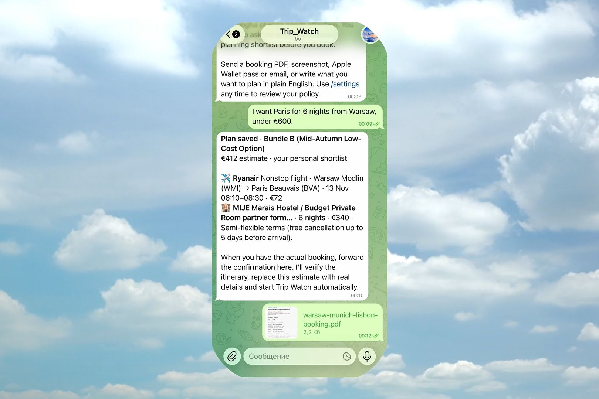
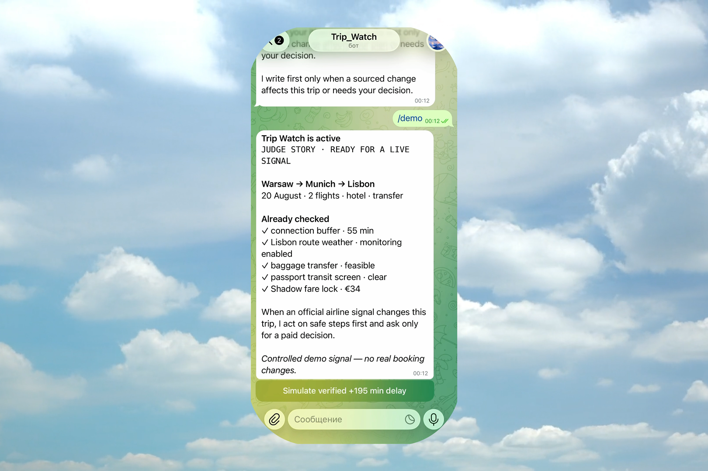
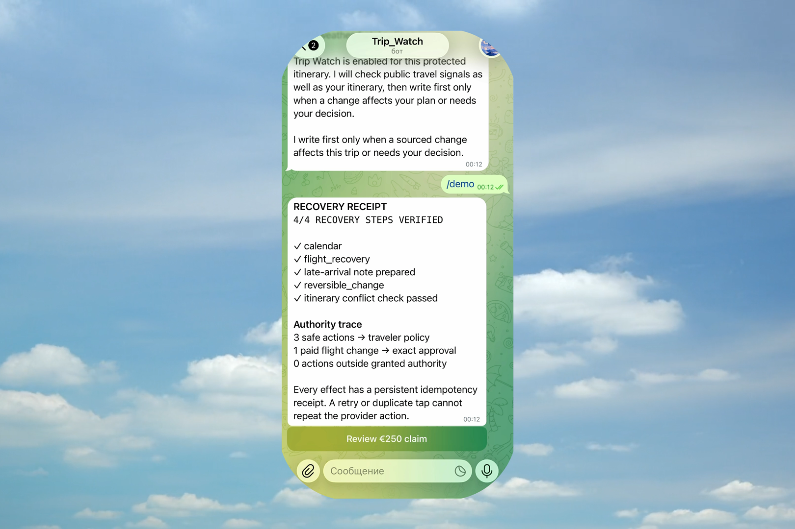

# Trip Watch — Autonomous Travel Recovery Agent

> **A Telegram-first travel agent that turns a booking into a protected trip: it plans a journey, reads travel documents, watches for disruption, repairs safe downstream work, and asks the traveler only when a consequential decision needs approval.**

[](https://trip-watch.vercel.app/)

<p align="center">
  <a href="https://trip-watch.vercel.app/"><strong>Landing</strong></a> ·
  <a href="https://t.me/tripagentai_bot"><strong>Open in Telegram</strong></a> ·
  <a href="https://youtu.be/ss1au4hfpug"><strong>Watch the demo</strong></a> ·
  <a href="docs/architecture-diagram.pdf"><strong>Architecture</strong></a>
</p>

<p align="center">
  <sub>Built with Gemini on Vertex AI · Google ADK · Cloud Run · Firestore · Pub/Sub</sub>
</p>

## Why Trip Watch

A delayed flight is not one notification. It can break a connection, leave luggage without enough transfer time, invalidate an airport pickup, turn a hotel booking into a no-show, and make a calendar obsolete. Travelers usually discover and repair these dependencies manually while stressed and in transit.

Trip Watch keeps one durable graph of the trip and works in the background. It distinguishes between:

- **safe, reversible work** the policy allows it to do autonomously;
- **consequential choices** involving money, penalties, uncertainty, or an irreversible change, which always return to the traveler for a single explicit approval.

The result is deliberately not another travel chatbot: a recovered trip is only reported after the workflow has persisted, executed idempotently, and verified the expected state.

## What works today

### 1. Plan before booking

In Telegram, a traveler can write a brief such as:

```text
I want Paris for 6 nights from Warsaw, under €600.
```

The agent asks only for missing essentials, returns up to three comparable transport + hotel options, and labels each as either **Search-grounded** (when Vertex AI returns valid Google Search grounding evidence) or **Estimate** (when live search is unavailable). Every option includes source links and is never represented as a booked itinerary. Selecting an option creates a persistent `PLANNED` trip; forwarding a real booking later replaces the estimate with confirmed itinerary data.

### 2. Import an already-booked trip

Forward a PDF ticket, Booking/Airbnb confirmation, screenshot, booking email, or `.pkpass` file. Gemini on Vertex AI extracts structured itinerary facts when configured; a bounded deterministic fallback reads only explicit PDF text or `pass.json` metadata and refuses to invent missing travel data. The intake supports hotel-only evidence without fabricating a flight.

The safe demo pack is in [demo/fixtures](demo/fixtures/README.md). It contains no valid reservation, payment, passport, or personal data.

### 3. Watch, reason, and act

After the traveler confirms the draft, Trip Watch creates focused watchpoints for flights, airport operations, route weather, hotel arrival, transfer, and connected trip dependencies. The background worker:

1. collects bounded, source-linked signals;
2. validates whether a signal is actionable;
3. computes the blast radius through the trip graph;
4. applies the traveler’s autonomy policy;
5. executes safe actions through idempotent provider adapters;
6. pauses for a single approval when a decision exceeds authority;
7. resumes from Firestore, re-reads provider state, and sends a verified result.

The canonical controlled scenario is a Warsaw → Munich → Lisbon journey. A +195 minute disruption makes the connection infeasible, surfaces visa and baggage checks, performs safe downstream updates, then asks once before the €34 recovery action because the traveler’s automatic-spend ceiling is €20. A review-only EU261 claim draft is available only after the evidence threshold is met.

### 4. Safety is product behavior, not a disclaimer

- Gemini may interpret, summarize, and rank **validated** facts; deterministic code owns time feasibility, money, policy, state transitions, idempotency, and verification.
- Gemini has no payment authority. Real ticketing and card charging are disabled.
- Approval tokens are owner-bound, short-lived, signed, versioned, and single-use.
- Provider effects use semantic idempotency keys and are verified after execution; duplicate events and clicks do not repeat effects.
- File intake checks MIME bytes, size limits, and `.pkpass` archive expansion limits before model processing.
- `/delete_my_data` removes the authenticated traveler’s stored trip data and connection metadata; see [privacy and retention](docs/PRIVACY_AND_RETENTION.md).

## Why Gemini and Google Cloud are essential

Trip Watch is built for the **Taskmaster** track of the All Things Agentic Hackathon: an event-driven, multi-step workflow that takes action rather than merely answering a question.

| Layer | Role in Trip Watch |
| --- | --- |
| **Gemini 3.5 Flash+ on Vertex AI** | Multimodal document understanding, source-grounded planning/watch interpretation, and concise traveler explanations. |
| **Google ADK** | Typed agent boundary around Gemini interpretation and validation. |
| **Cloud Run** | Separate public Telegram edge and private workflow worker services. |
| **Firestore** | Durable trip graph, policy, incident, approval, outbox, and effect-receipt state. |
| **Pub/Sub** | Authenticated disruption and workflow-resume commands across process boundaries. |
| **Secret Manager** | Secrets and optional user-managed Gemini / OAuth credential storage. |

The architecture is intentionally split: the public edge verifies Telegram requests and forwards authenticated commands, while the private worker has recovery authority. The worker is not made public merely to accommodate a webhook.

## Architecture

```text
Telegram / public travel signals / controlled demo event
                         │
                         ▼
        Cloud Run edge — validates Telegram request + routing
                         │ authenticated invocation
                         ▼
     Cloud Run worker — FastAPI + Google ADK + Gemini / Vertex AI
        │              │                  │
        │              │                  └─ multimodal extraction / grounded reasoning
        │              └─ deterministic impact, policy, recovery, verification
        ▼
Firestore: trips, dependency graph, watchpoints, incidents, approvals, outbox, receipts
        │
        ├─ Pub/Sub: disruption / durable resume commands
        └─ Telegram: proactive notice, approval, verified recovery receipt
```

Read the full [architecture](docs/ARCHITECTURE.md) and the documented [Google Cloud execution proof](docs/CLOUD_PROOF.md). The diagram that must be attached in Devpost is available as [PDF](docs/architecture-diagram.pdf) and [PNG](docs/architecture-diagram.png).

## Try the full agent journey (60–90 seconds)

The cleanest story starts with a fresh Telegram chat. Use the [synthetic PDF fixture](demo/fixtures/warsaw-munich-lisbon-booking.pdf); it is clearly labelled **DEMO ONLY / NOT VALID FOR TRAVEL**.

1. Open [@tripagentai_bot](https://t.me/tripagentai_bot) and send `/start`.
2. Complete the short autonomy policy. Buttons disappear after onboarding so the rest feels like normal chat.
3. Send: `I want Paris for 6 nights from Warsaw, under €600.` Select a plan to show that planning is distinct from booking.
4. Forward `demo/fixtures/warsaw-munich-lisbon-booking.pdf`. Review the extracted itinerary and press **Save trip**.
5. Send `/demo`, then select **Simulate verified +195 min delay**.
6. Show the proactive impact message: connection, weather, baggage and downstream work are assessed.
7. Select **Approve +€34**. The action resumes durably, reports **RECOVERY VERIFIED**, and exposes a review-only **€250 EU261** claim draft.

This is a controlled demo, not a claim that a synthetic booking was changed in the real world. The same code path uses persistent state, policy boundaries, idempotency, and verification.

> **For judges:** this flow demonstrates two distinct jobs: planning a trip before booking, then protecting an already-booked itinerary after a document is forwarded.

For the longer recording script, see [docs/SHOWCASE_01.md](docs/SHOWCASE_01.md). For a repeatable terminal-only proof, run the local recovery showcase below.

## Local setup

### Prerequisites

- Python 3.11+ (the container uses Python 3.12)
- Node.js 20+ for the landing page
- Optional: Google Cloud CLI and Application Default Credentials for real Vertex / Cloud service calls

```bash
git clone https://github.com/pfrhqxy6nk-blip/trip-recovery-agent.git
cd trip-recovery-agent

python3.12 -m venv .venv
.venv/bin/pip install -e '.[dev]'
cp .env.example .env
```

The local default is deterministic and does not require a Google account. Never commit `.env` or add credentials to Telegram.

### Run the API locally

```bash
PYTHONPATH=backend .venv/bin/python -m app.seed_demo
APP_ROLE=all PYTHONPATH=backend .venv/bin/uvicorn app.runtime:app --reload
```

Open the local API at `http://127.0.0.1:8000`. The simulator is intentionally disabled unless `ENABLE_SIMULATOR=true` and a 16+ byte `SIMULATOR_SECRET` are set in local `.env`.

### Run the landing page

```bash
cd landing
npm install
npm run dev
```

For the deployed product page, use [trip-watch.vercel.app](https://trip-watch.vercel.app/).

### Optional Google Cloud configuration

For actual Vertex AI calls, authenticate locally and set an eligible model ID in `.env`:

```bash
gcloud auth application-default login
# then set GEMINI_MODEL_ID to the enabled Gemini 3.5+ model for the configured location
```

The Calendar and Gmail adapters are intentionally feature-gated until their OAuth client, exact HTTPS callback URIs, Secret Manager permissions, and provider reread checks are configured. Gmail uses only `gmail.compose` to create a draft; it does not read a mailbox or send email. See [FIRST_USER_RUNBOOK.md](docs/FIRST_USER_RUNBOOK.md).

## Reproducible verification

Run the complete local submission gate:

```bash
scripts/run_submission_gate.sh
```

It runs backend tests, Ruff, strict mypy, Python compilation, deployment preflight checks, canonical autonomous recovery, landing production build, landing packaging tests, English-copy checks, and `git diff --check`.

Useful focused checks:

```bash
# Deterministic end-to-end recovery: no Telegram, no external booking change
PYTHONPATH=backend .venv/bin/python -m app.demo_recovery

# Beta fixtures are intentionally reproducible
.venv/bin/python scripts/build_beta_fixtures.py

# Optional owner-only read-only live contract: requires untracked local secrets
set -a; source .env; set +a; RUN_LIVE_CHECK=1 scripts/run_submission_gate.sh
```

`RUN_LIVE_CHECK=1` validates the existing live contract without sending a synthetic user message or changing infrastructure. A real `/start` must still be performed manually in Telegram before recording.

## Deployment model

The Cloud Run deployment is conservative by design:

- `APP_ROLE=edge` is public only for health, Telegram ingress, and credential connection pages.
- `APP_ROLE=worker` exposes internal routes behind Cloud Run IAM and processes Pub/Sub / recovery work.
- `APP_ROLE=all` is local-development only.

Deployment preflight and IAM guidance are in [infra/cloudrun/README.md](infra/cloudrun/README.md). Scripts are inert unless `APPLY=true` is explicitly provided. Do not enable real provider mutation, Calendar writes, Gmail drafts, or live flight monitoring without the relevant credentials and an end-to-end reread verification.

## Scope and honest limitations

Trip Watch is a functioning hackathon prototype with a real Telegram surface and deployed Google Cloud architecture. It is **not** yet a consumer airline booking service.

- Planning options are estimates until a traveler forwards booking evidence; no inventory is booked by selecting one.
- Judge mode and fixtures are bounded controlled scenarios. Search grounding can be unavailable because of quota/capacity and is labelled honestly when that occurs.
- Direct airline rebooking, payment capture, hotel/transfer mutations, live Calendar writes, Gmail drafts, and live provider webhooks remain disabled unless separately configured and verified.
- Compensation output is a reviewable draft, not legal advice and not an automatically sent claim.
- Visa and baggage screening are cautious heuristics; ambiguous results are escalated to the traveler rather than treated as clearance.

The complete privacy, data-retention, and financial-authority boundary is in [docs/PRIVACY_AND_RETENTION.md](docs/PRIVACY_AND_RETENTION.md).

## How it was built

The product was developed by iterating on one traveler journey rather than assembling a generic chat interface:

1. Model a trip as a dependency graph and make deterministic code authoritative for time, money, policy, and recovery state.
2. Add Gemini through Google ADK only where multimodal understanding, grounded interpretation, ranking, and clear explanations improve the traveler experience.
3. Make the agent durable: Firestore stores state, Pub/Sub transports commands, Cloud Run processes background work, and each external effect gets an idempotency receipt.
4. Build a minimal Telegram experience: short onboarding buttons, then ordinary English conversation; interruptions appear only when authority is needed.
5. Test edge cases deliberately — duplicated callbacks, stale approvals, unreadable artifacts, provider failure, restart recovery, and disconnected integrations.
6. Create safe synthetic fixtures so a judge can reproduce the full journey without exposing a real traveler’s reservation or payment data.

Codex was used as a development collaborator for implementation planning, code iteration, QA flows, test coverage, architecture documentation, landing refinement, and reproducibility checks. The repository documents the underlying product decisions and boundaries in [docs/hackathon-build](docs/hackathon-build).

## Submission materials

- **Public landing:** [https://trip-watch.vercel.app/](https://trip-watch.vercel.app/)
- **Telegram product:** [@tripagentai_bot](https://t.me/tripagentai_bot)
- **Repository:** [pfrhqxy6nk-blip/trip-recovery-agent](https://github.com/pfrhqxy6nk-blip/trip-recovery-agent)
- **Public demo video:** [Trip Watch — AI Travel Recovery Agent](https://youtu.be/ss1au4hfpug)
- **Architecture attachment:** [PDF](docs/architecture-diagram.pdf) / [PNG](docs/architecture-diagram.png)
- **Safe judge fixtures:** [demo/fixtures](demo/fixtures/README.md)
- **Devpost copy draft:** [devpost-submission.md](devpost-submission.md)
- **Official-requirements audit:** [docs/DEVPOST_READINESS.md](docs/DEVPOST_READINESS.md)

### Product gallery

From first idea to verified recovery — the same story shown in the demo video.

| Plan and import | Autonomous watch |
| --- | --- |
| [](docs/submission-media/02-plan-and-import.png) | [](docs/submission-media/03-trip-watch-ready.png) |
| **Plan first.** Compare options without pretending to book anything. Then forward the actual travel evidence. | **Watch quietly.** Model the connection, weather, baggage, hotel, and transfer dependencies. |

| Verified result | |
| --- | --- |
| [](docs/submission-media/04-recovery-receipt.png) | **Recover with boundaries.** Safe actions run automatically; the €34 option waits for one explicit approval, then produces a verified receipt. |

### Post-submission notes

The project was submitted to Devpost on 30 August 2026. Any subsequent repository updates are documentation, reproducibility, or presentation improvements only; they do not change the product scope shown in the submitted demo.

See [post-submission notes](docs/POST_SUBMISSION_NOTES.md) for the maintenance boundary.

## License and third-party services

Before public launch, add the final project license and complete a third-party license / terms audit for every live provider enabled in a deployment. The current beta fixtures are generated in-repository and contain no real booking data. Google Cloud, Telegram, Duffel, Amadeus, Google Workspace, and any live travel-data provider remain subject to their respective terms and credentials.
